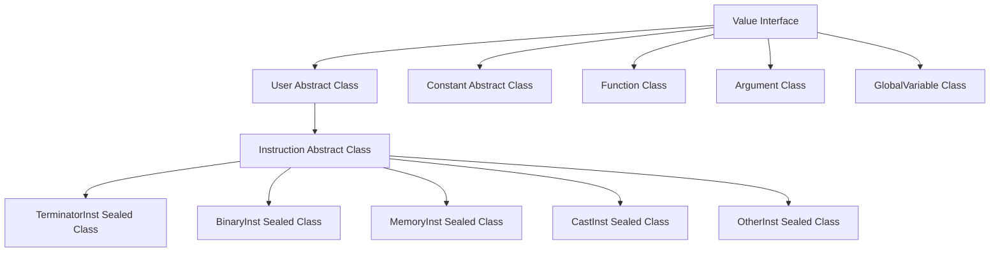
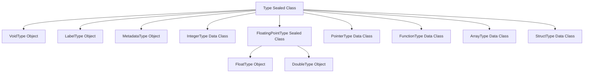
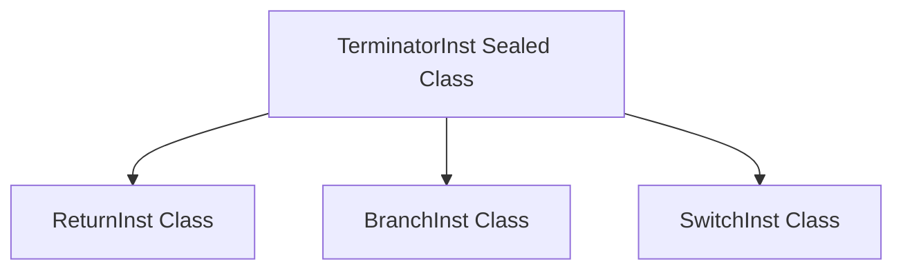
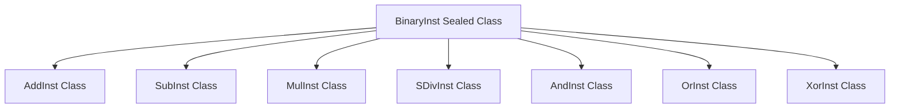
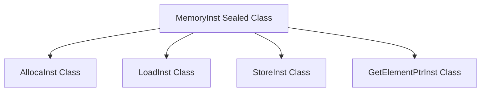
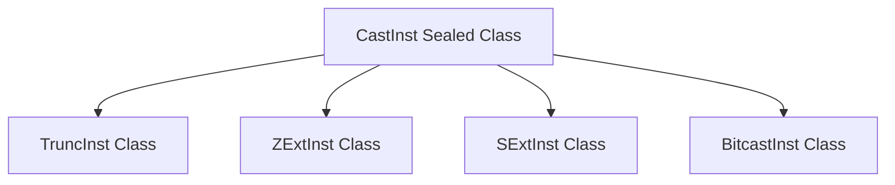
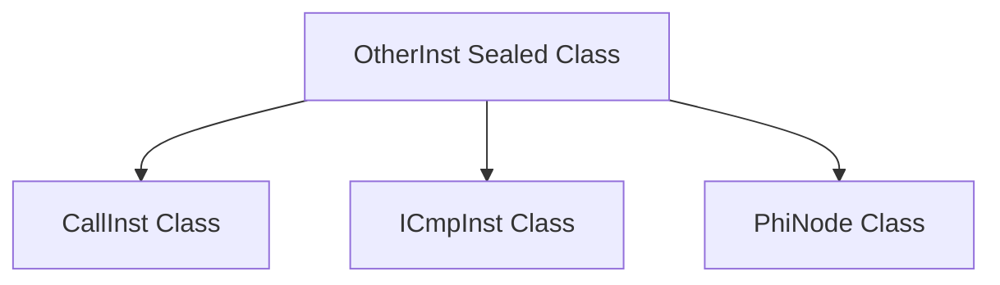
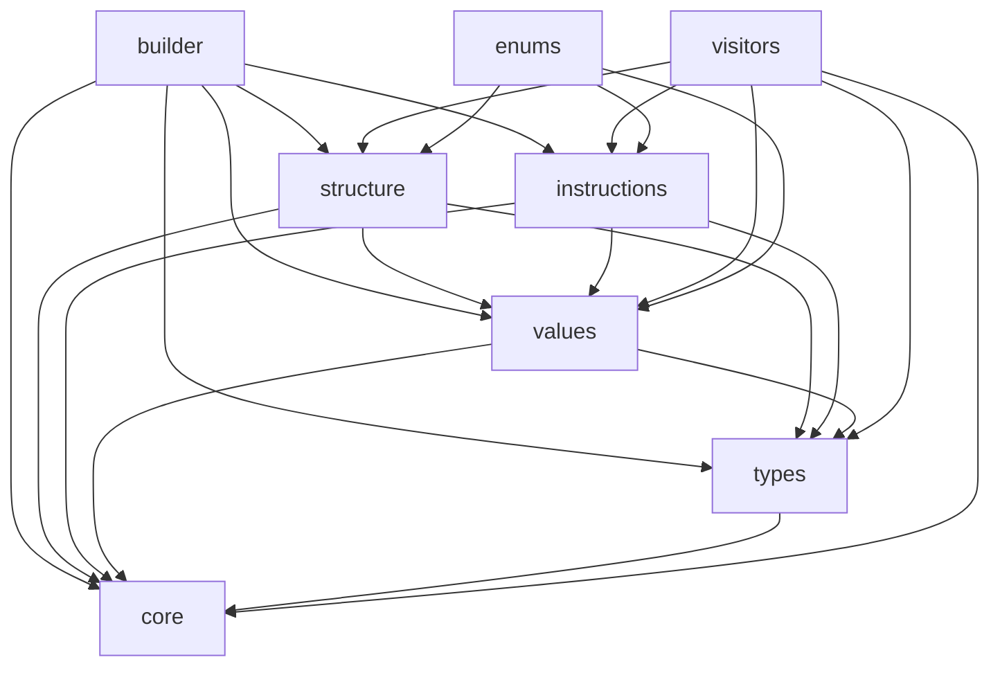

# LLVM Kotlin Integration - Detailed Class Layout Map

## Project Overview

This document provides a comprehensive class layout map for the LLVM IR generation system in Kotlin. It defines the folder structure, inheritance hierarchy, and placement of all classes based on the design philosophy outlined in the base document.

## LLVM IR Compliance Status

**⚠️ Important Notice:** This implementation follows the **legacy LLVM IR typed pointer model** and does **NOT** comply with the latest LLVM IR standard which uses untyped pointers.

- **Current Implementation:** Typed pointers (e.g., `i32*`, `i8*`) where each pointer carries its pointee type information
- **LLVM IR Standard (Latest):** Untyped pointers where all pointers are simply `ptr` regardless of pointee type
- **Migration Path:** See the roadmap document for planned migration phases to untyped pointers

## Folder Structure

```
src/
├── main/
│   └── kotlin/space/norb/
│       └── llvm/
│           ├── core/                    # Core abstractions and base classes
│           │   ├── Value.kt
│           │   ├── Type.kt
│           │   ├── User.kt
│           │   └── Constant.kt
│           ├── types/                   # Type system implementations
│           │   ├── PrimitiveTypes.kt
│           │   ├── DerivedTypes.kt
│           │   └── TypeUtils.kt
│           ├── values/                  # Value implementations
│           │   ├── constants/
│           │   │   ├── IntConstant.kt
│           │   │   ├── FloatConstant.kt
│           │   │   └── NullPointerConstant.kt
│           │   └── globals/
│           │       └── GlobalVariable.kt
│           ├── structure/               # Structural components
│           │   ├── Module.kt
│           │   ├── Function.kt
│           │   ├── Argument.kt
│           │   └── BasicBlock.kt
│           ├── instructions/            # Instruction hierarchy
│           │   ├── base/
│           │   │   ├── Instruction.kt
│           │   │   ├── TerminatorInst.kt
│           │   │   ├── BinaryInst.kt
│           │   │   ├── MemoryInst.kt
│           │   │   ├── CastInst.kt
│           │   │   └── OtherInst.kt
│           │   ├── terminators/
│           │   │   ├── ReturnInst.kt
│           │   │   ├── BranchInst.kt
│           │   │   └── SwitchInst.kt
│           │   ├── binary/
│           │   │   ├── AddInst.kt
│           │   │   ├── SubInst.kt
│           │   │   ├── MulInst.kt
│           │   │   ├── SDivInst.kt
│           │   │   ├── AndInst.kt
│           │   │   ├── OrInst.kt
│           │   │   └── XorInst.kt
│           │   ├── memory/
│           │   │   ├── AllocaInst.kt
│           │   │   ├── LoadInst.kt
│           │   │   ├── StoreInst.kt
│           │   │   └── GetElementPtrInst.kt
│           │   ├── casts/
│           │   │   ├── TruncInst.kt
│           │   │   ├── ZExtInst.kt
│           │   │   ├── SExtInst.kt
│           │   │   └── BitcastInst.kt
│           │   └── other/
│           │       ├── CallInst.kt
│           │       ├── ICmpInst.kt
│           │       └── PhiNode.kt
│           ├── builder/                  # IR construction utilities
│           │   ├── IRBuilder.kt
│           │   └── BuilderUtils.kt
│           ├── visitors/                 # Visitor pattern implementations
│           │   ├── IRVisitor.kt
│           │   ├── IRPrinter.kt
│           │   └── IRValidator.kt
│           └── enums/                   # Enumerations and constants
│               ├── LinkageType.kt
│               └── IcmpPredicate.kt
└── test/
    └── kotlin/space/norb/
        └── llvm/
            └── [corresponding test structure]
```

## Class Inheritance Hierarchy

### Core Abstractions

#### Value System


#### Type System


### Instruction Hierarchy

#### Terminator Instructions


#### Binary Instructions


#### Memory Instructions


#### Cast Instructions


#### Other Instructions


## Detailed Class Specifications

### Core Package: `space.norb.llvm.core`

#### Value.kt
```kotlin
interface Value {
    val name: String
    val type: Type
}
```

#### Type.kt
```kotlin
sealed class Type

// Primitive types will be in types/PrimitiveTypes.kt
// Derived types will be in types/DerivedTypes.kt
```

#### User.kt
```kotlin
abstract class User(
    override val name: String,
    override val type: Type,
    val operands: List<Value>
) : Value
```

#### Constant.kt
```kotlin
abstract class Constant(
    override val name: String,
    override val type: Type
) : Value
```

### Types Package: `space.norb.llvm.types`

#### PrimitiveTypes.kt
```kotlin
object VoidType : Type()
object LabelType : Type()
object MetadataType : Type()
data class IntegerType(val bitWidth: Int) : Type()

sealed class FloatingPointType : Type() {
    object FloatType : FloatingPointType()
    object DoubleType : FloatingPointType()
}
```

#### DerivedTypes.kt
```kotlin
// Legacy Typed Pointer Implementation (⚠️ Not compliant with latest LLVM IR standard)
data class PointerType(val pointeeType: Type) : Type() {
    override fun toString(): String = "${pointeeType.toString()}*"
    // Type checking methods...
}

data class FunctionType(
    val returnType: Type,
    val paramTypes: List<Type>,
    val isVarArg: Boolean = false
) : Type()
data class ArrayType(val numElements: Int, val elementType: Type) : Type()
data class StructType(val elementTypes: List<Type>, val isPacked: Boolean = false) : Type()

/*
Note on PointerType Implementation:
- Current implementation uses typed pointers (legacy LLVM IR model)
- Latest LLVM IR standard uses untyped pointers (simply "ptr")
- Migration to untyped pointers is planned (see roadmap)
- Example: Current "i32*" will become "ptr" in future implementation
*/
```

### Values Package: `space.norb.llvm.values`

#### constants/IntConstant.kt
```kotlin
data class IntConstant(
    val value: Long,
    override val type: IntegerType
) : Constant(value.toString(), type)
```

#### constants/FloatConstant.kt
```kotlin
data class FloatConstant(
    val value: Double,
    override val type: FloatingPointType
) : Constant(value.toString(), type)
```

#### constants/NullPointerConstant.kt
```kotlin
class NullPointerConstant(
    override val type: PointerType  // Legacy typed pointer
) : Constant("null", type)

/*
Note on NullPointerConstant:
- Currently requires a specific PointerType (e.g., i32*, i8*)
- In untyped pointer model, this will simplify to a single null pointer type
- Migration will affect how null pointers are created and type-checked
*/
```

#### globals/GlobalVariable.kt
```kotlin
class GlobalVariable(
    override val name: String,
    override val type: PointerType,
    val module: Module,
    val initializer: Constant? = null,
    val isConstant: Boolean = false,
    val linkage: LinkageType = LinkageType.EXTERNAL
) : Constant(name, type)
```

### Structure Package: `space.norb.llvm.structure`

#### Module.kt
```kotlin
class Module(val name: String) {
    val functions: MutableList<Function> = mutableListOf()
    val globalVariables: MutableList<GlobalVariable> = mutableListOf()
    val namedMetadata: MutableMap<String, Metadata> = mutableMapOf()
    var targetTriple: String? = null
    var dataLayout: String? = null
}
```

#### Function.kt
```kotlin
class Function(
    override val name: String,
    override val type: FunctionType,
    val module: Module
) : Value {
    val returnType: Type = type.returnType
    val parameters: List<Argument> = type.paramTypes.mapIndexed { index, paramType ->
        Argument("arg$index", paramType, this, index)
    }
    val basicBlocks: MutableList<BasicBlock> = mutableListOf()
    var entryBlock: BasicBlock? = null
}
```

#### Argument.kt
```kotlin
class Argument(
    override val name: String,
    override val type: Type,
    val function: Function,
    val index: Int
) : Value
```

#### BasicBlock.kt
```kotlin
class BasicBlock(
    override val name: String,
    val function: Function
) : Value {
    override val type: LabelType = LabelType
    val instructions: MutableList<Instruction> = mutableListOf()
    var terminator: TerminatorInst? = null
}
```

### Instructions Package: `space.norb.llvm.instructions`

#### base/Instruction.kt
```kotlin
abstract class Instruction(
    override val name: String,
    override val type: Type,
    operands: List<Value>
) : User(name, type, operands) {
    lateinit var parent: BasicBlock
}
```

#### base/TerminatorInst.kt
```kotlin
sealed class TerminatorInst(
    name: String,
    type: Type,
    operands: List<Value>
) : Instruction(name, type, operands)
```

#### base/BinaryInst.kt
```kotlin
sealed class BinaryInst(
    name: String,
    type: Type,
    val lhs: Value,
    val rhs: Value
) : Instruction(name, type, listOf(lhs, rhs))
```

#### base/MemoryInst.kt
```kotlin
sealed class MemoryInst(
    name: String,
    type: Type,
    operands: List<Value>
) : Instruction(name, type, operands)
```

#### base/CastInst.kt
```kotlin
sealed class CastInst(
    name: String,
    override val type: Type,
    val value: Value
) : Instruction(name, type, listOf(value))
```

#### base/OtherInst.kt
```kotlin
sealed class OtherInst(
    name: String,
    type: Type,
    operands: List<Value>
) : Instruction(name, type, operands)
```

### Builder Package: `space.norb.llvm.builder`

#### IRBuilder.kt
```kotlin
class IRBuilder(val module: Module) {
    private var currentBlock: BasicBlock? = null
    private var insertionPoint: MutableListIterator<Instruction>? = null
    
    // Positioning methods
    fun positionAtEnd(block: BasicBlock) { /* implementation */ }
    fun positionBefore(instruction: Instruction) { /* implementation */ }
    fun clearInsertionPoint() { /* implementation */ }
    
    // IR Construction methods
    fun createFunction(name: String, type: FunctionType): Function { /* implementation */ }
    fun createBasicBlock(name: String, function: Function): BasicBlock { /* implementation */ }
    
    // Terminator methods
    fun buildRet(value: Value?): ReturnInst { /* implementation */ }
    fun buildBr(target: BasicBlock): BranchInst { /* implementation */ }
    fun buildCondBr(condition: Value, trueTarget: BasicBlock, falseTarget: BasicBlock): BranchInst { /* implementation */ }
    
    // Binary operations
    fun buildAdd(lhs: Value, rhs: Value, name: String = ""): AddInst { /* implementation */ }
    fun buildSub(lhs: Value, rhs: Value, name: String = ""): SubInst { /* implementation */ }
    fun buildMul(lhs: Value, rhs: Value, name: String = ""): MulInst { /* implementation */ }
    
    // Memory operations
    fun buildAlloca(type: Type, name: String = ""): AllocaInst { /* implementation */ }
    fun buildLoad(address: Value, name: String = ""): LoadInst { /* implementation */ }
    fun buildStore(value: Value, address: Value): StoreInst { /* implementation */ }
    fun buildGep(address: Value, indices: List<Value>, name: String = ""): GetElementPtrInst { /* implementation */ }
    
    // Other operations
    fun buildCall(function: Function, args: List<Value>, name: String = ""): CallInst { /* implementation */ }
    fun buildICmp(pred: IcmpPredicate, lhs: Value, rhs: Value, name: String = ""): ICmpInst { /* implementation */ }
}
```

### Visitors Package: `space.norb.llvm.visitors`

#### IRVisitor.kt
```kotlin
interface IRVisitor<T> {
    fun visitModule(module: Module): T
    fun visitFunction(function: Function): T
    fun visitBasicBlock(block: BasicBlock): T
    
    // Value visitors
    fun visitArgument(argument: Argument): T
    fun visitGlobalVariable(globalVariable: GlobalVariable): T
    fun visitConstant(constant: Constant): T
    
    // Instruction visitors
    fun visitReturnInst(inst: ReturnInst): T
    fun visitBranchInst(inst: BranchInst): T
    fun visitSwitchInst(inst: SwitchInst): T
    fun visitAddInst(inst: AddInst): T
    fun visitSubInst(inst: SubInst): T
    fun visitMulInst(inst: MulInst): T
    fun visitSDivInst(inst: SDivInst): T
    fun visitAndInst(inst: AndInst): T
    fun visitOrInst(inst: OrInst): T
    fun visitXorInst(inst: XorInst): T
    fun visitAllocaInst(inst: AllocaInst): T
    fun visitLoadInst(inst: LoadInst): T
    fun visitStoreInst(inst: StoreInst): T
    fun visitGetElementPtrInst(inst: GetElementPtrInst): T
    fun visitTruncInst(inst: TruncInst): T
    fun visitZExtInst(inst: ZExtInst): T
    fun visitSExtInst(inst: SExtInst): T
    fun visitBitcastInst(inst: BitcastInst): T
    fun visitCallInst(inst: CallInst): T
    fun visitICmpInst(inst: ICmpInst): T
    fun visitPhiNode(inst: PhiNode): T
}
```

#### IRPrinter.kt
```kotlin
class IRPrinter : IRVisitor<Unit> {
    private val output = StringBuilder()
    private var indentLevel = 0
    
    fun print(module: Module): String {
        visitModule(module)
        return output.toString()
    }
    
    override fun visitModule(module: Module) { /* implementation */ }
    override fun visitFunction(function: Function) { /* implementation */ }
    override fun visitBasicBlock(block: BasicBlock) { /* implementation */ }
    
    // Implement all other visit methods...
}
```

### Enums Package: `space.norb.llvm.enums`

#### LinkageType.kt
```kotlin
enum class LinkageType {
    EXTERNAL,
    PRIVATE,
    INTERNAL,
    LINK_ONCE,
    WEAK,
    COMMON,
    APPENDING,
    EXTERN_WEAK,
    AVAILABLE_EXTERNALLY,
    DLL_IMPORT,
    DLL_EXPORT,
    EXTERNAL_WEAK,
    GHOST,
    LINKER_PRIVATE,
    LINKER_PRIVATE_WEAK
}
```

#### IcmpPredicate.kt
```kotlin
enum class IcmpPredicate {
    EQ,      // Equal
    NE,      // Not Equal
    UGT,     // Unsigned Greater Than
    UGE,     // Unsigned Greater or Equal
    ULT,     // Unsigned Less Than
    ULE,     // Unsigned Less or Equal
    SGT,     // Signed Greater Than
    SGE,     // Signed Greater or Equal
    SLT,     // Signed Less Than
    SLE      // Signed Less or Equal
}
```

## Design Principles Implementation

### 1. Strong Typing
- All LLVM types are represented as sealed classes with specific properties
- Type safety is enforced through Kotlin's type system
- No implicit conversions between types
- **⚠️ Pointer Type Limitation:** Current implementation uses legacy typed pointers which are more restrictive than the latest LLVM IR standard

### 2. Immutability
- IR objects are immutable after construction
- The `IRBuilder` manages the mutable construction phase
- Collections are exposed as read-only where possible

### 3. Clear Ownership
- `Module` owns `Function`s and `GlobalVariable`s
- `Function` owns `BasicBlock`s and `Argument`s
- `BasicBlock` owns `Instruction`s
- Parent-child relationships are explicitly maintained

### 4. Extensibility
- Sealed class hierarchies allow for easy addition of new instructions
- Visitor pattern enables adding new operations without modifying existing classes
- Interface-based design allows for alternative implementations

### 5. Builder Pattern
- `IRBuilder` provides a fluent API for IR construction
- Manages insertion points and object creation details
- Provides type-safe methods for all instruction types

## Package Dependencies



## Implementation Guidelines

### 1. Class Organization
- Each package should focus on a specific domain (types, values, instructions, etc.)
- Abstract base classes should be in `base/` subpackages
- Concrete implementations should be in appropriately named subpackages

### 2. Naming Conventions
- Interface names should be descriptive (e.g., `Value`, `IRVisitor`)
- Abstract classes should indicate their nature (e.g., `Instruction`, `Constant`)
- Concrete classes should be specific (e.g., `AddInst`, `IntConstant`)
- Sealed classes should be used for type hierarchies with known subclasses

### 3. Visibility
- Public APIs should be carefully designed and documented
- Internal implementation details should use internal or private visibility
- Package-private visibility should be used for classes that are only used within a package

### 4. Testing Strategy
- Each package should have corresponding test packages
- Unit tests should focus on individual class behavior
- Integration tests should verify the interaction between components
- The visitor pattern should be tested with mock implementations

This comprehensive class layout map provides a solid foundation for implementing the LLVM IR generation system in Kotlin, following best practices for package organization, inheritance hierarchies, and maintainable code structure.